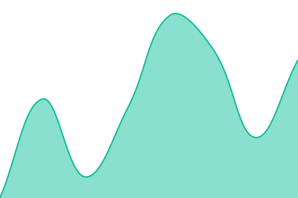
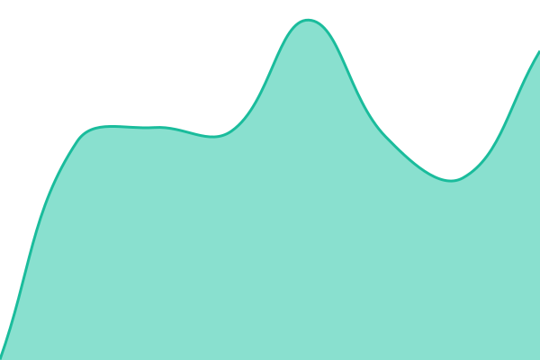
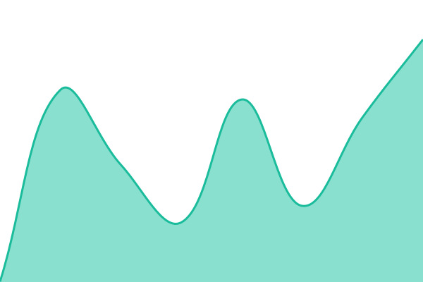
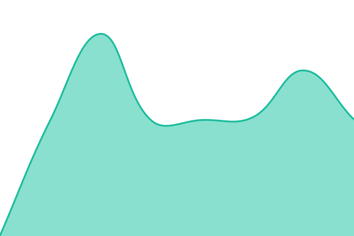

# [📈 Live Status](https://status.grnyte.rocks): <!--live status--> **🟧 Partial outage**

This repository contains the open-source uptime monitor and status page for [Robert Wettstädt](https://robert.wettstaedt.dev), powered by [Upptime](https://github.com/upptime/upptime).

With [Upptime](https://upptime.js.org), you can get your own unlimited and free uptime monitor and status page, powered entirely by a GitHub repository. We use [Issues](https://github.com/robert-wettstaedt/grnyte-status/issues) as incident reports, [Actions](https://github.com/robert-wettstaedt/grnyte-status/actions) as uptime monitors, and [Pages](https://status.grnyte.rocks) for the status page.

<!--start: status pages-->
<!-- This summary is generated by Upptime (https://github.com/upptime/upptime) -->
<!-- Do not edit this manually, your changes will be overwritten -->
<!-- prettier-ignore -->
| URL | Status | History | Response Time | Uptime |
| --- | ------ | ------- | ------------- | ------ |
|  [Prod](https://grnyte.rocks) | 🟩 Up | [prod.yml](https://github.com/robert-wettstaedt/grnyte-status/commits/HEAD/history/prod.yml) | 

 212ms
     
 | 

<a href="https://status.grnyte.rocks/history/prod">100.00%</a>
    

|  [Prod sync](https://zero.grnyte.rocks) | 🟩 Up | [prod-sync.yml](https://github.com/robert-wettstaedt/grnyte-status/commits/HEAD/history/prod-sync.yml) | 

 542ms
     
 | 

<a href="https://status.grnyte.rocks/history/prod-sync">100.00%</a>
    

|  [Prod accounts](https://vamttgjugazgeujczjcr.supabase.co/auth/v1/callback) | 🟩 Up | [prod-accounts.yml](https://github.com/robert-wettstaedt/grnyte-status/commits/HEAD/history/prod-accounts.yml) | 

 868ms
     
 | 

<a href="https://status.grnyte.rocks/history/prod-accounts">99.76%</a>
    

|  [Demo](https://demo.grnyte.rocks) | 🟩 Up | [demo.yml](https://github.com/robert-wettstaedt/grnyte-status/commits/HEAD/history/demo.yml) | 

 358ms
     
 | 

<a href="https://status.grnyte.rocks/history/demo">100.00%</a>
    

|  [Demo sync](https://zero.demo.grnyte.rocks) | 🟩 Up | [demo-sync.yml](https://github.com/robert-wettstaedt/grnyte-status/commits/HEAD/history/demo-sync.yml) | 

 516ms
     
 | 

<a href="https://status.grnyte.rocks/history/demo-sync">100.00%</a>
    

|  [Demo accounts](https://niniugtqbfituyzfoapv.supabase.co/auth/v1/callback) | 🟥 Down | [demo-accounts.yml](https://github.com/robert-wettstaedt/grnyte-status/commits/HEAD/history/demo-accounts.yml) | 

 38ms
     
 | 

<a href="https://status.grnyte.rocks/history/demo-accounts">99.76%</a>
    

<!--end: status pages-->

[**Visit our status website →**](https://status.grnyte.rocks)

## 📄 License

- Powered by: [Upptime](https://github.com/upptime/upptime)
- Code: [MIT](./LICENSE) © [Anand Chowdhary](https://anandchowdhary.com)
- Data in the `./history` directory: [Open Database License](https://opendatacommons.org/licenses/odbl/1-0/)
